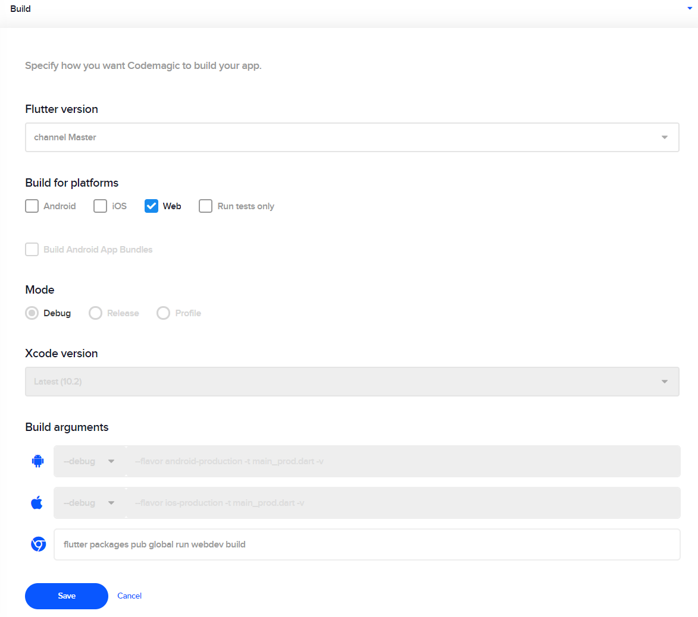

---
categories:
  - Build configuration
description: See how to build a Flutter web app with Codemagic.
title: Building for the web
weight: 5
---

You can build, test and publish Flutter web apps with Codemagic.

## Project structure requirements

Codemagic can detect your Flutter web project if it meets the following conditions:

- The project has a `web` folder
- There’s a `flutter_web` dependency in `pubspec.yaml`

## Build configuration

If your project has the proper structure and configuration of a web project, Codemagic will automatically build the web app when you click **Run your first build**. During the installing dependencies step, we run `flutter packages pub global activate webdev` which activates the `webdev` package necessary for building the release version of Flutter web app. If you want to use a different package, you can set it up in a custom pre-build script.

You can review the build settings in **App settings > Build**.

The following is necessary to build the web app:

1. Select a **Flutter version**. Flutter for web is supported starting from Flutter v1.5.4. If you're actively developing Flutter for web, you may prefer selecting one of the unstable channels.
2. Select **Web** under Build for platforms. If your project is detected correctly as a web project, you'll already see it selected in the UI.
3. Specify the command for building the app under **Build arguments**. By default, Codemagic is configured to run the `flutter packages pub global run webdev build` command, but you can enter a different command to be run.

When you make any changes to the default settings, make sure to hit **Save** before you start the build for the changes to take effect.

## Build artifacts

At the end of a successful build, Codemagic generates a `.zip` file of the contents of `$FCI_BUILD_DIR/build` and exports this as an artifact. You can either download it or set up publishing to [Codemagic Static Pages](https://docs.codemagic.io/publishing/publishing-to-codemagic-static-pages/) or to third-party hosting sites using custom scripts.
