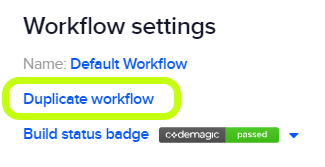

---
categories:
  - Getting started with Codemagic CI/CD
date: '2019-03-26T16:00:30+02:00'
description: Manage multiple workflows to fully customize your CI/CD pipeline
title: Creating workflows
weight: 3
---

Have full control over your CI/CD pipeline with workflows. A workflow is a set of settings that determines how your app is to be built, tested and published. You can create several workflows for building different configurations of your app. For example, you can use workflows to build different branches of the project, separate your debug and release builds, run builds for different projects or flavors in the repository, test your app with different software versions, and so on.

You can create new workflows by duplicating existing ones. In app settings, click **Duplicate workflow** under Workflow settings.

This creates a new workflow with the exact same settings as you had configured for the original workflow. All your environment variables and scripts, build settings and signing files will be duplicated into the new workflow.

You can then click on the name of the workflow to edit it and configure the workflow settings as you like. Now that you have more than one workflow, you can also delete workflows.

To switch between workflows, click on the workflow name below the app name in app settings.

{}
Note that while your workflows started out as duplicates, they become separate entities once created. Any changes made to one workflow won't affect any of the others.
{}
